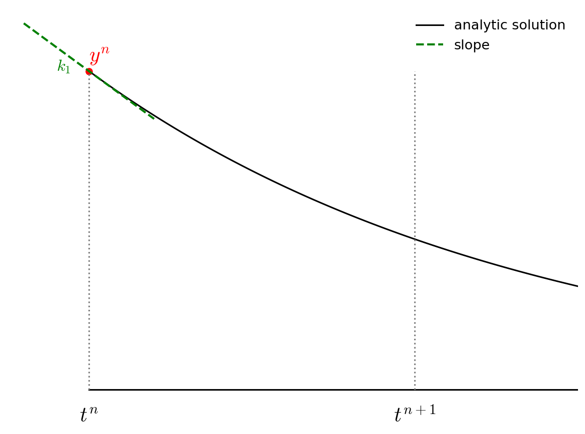
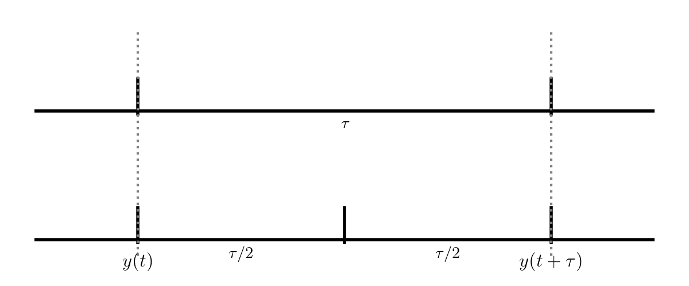

********************
Adaptive Runge-Kutta
********************

Previously we looked at the simple Euler and 2nd-order Runge-Kutta
methods for integration.  Now we will look at 4th order Runge-Kutta.
We will also:

* Write our integrator as a templated class that works with any
  ODE system of the form:

  .. math::

     \frac{d{\bf y}}{dt} = {\bf f}(t, {\bf y})

* Adapt the timestep taken internally to achieve a user-desired
  error in the solution.

4th order RK
============

The advance begins by estimating the derivatives (righthand side or slope) at time $t^n$.  We'll call this ${\bf k}_1$.

$${\bf k}_1 = {\bf f}(t^n, {\bf y}^n)$$

We then follow the slope ${\bf k}_1$ to the midpoint in time, $t^{n+1/2}$ and evaluate the slope there.  We call the new slope ${\bf k}_2$.

$${\bf k}_2 = {\bf f}(t^n + \tau/2, {\bf y}^n + (\tau/2) {\bf k}_1)$$

.. figure:: rk4_k2.png
   :align: center
   :width: 90%

We then go back to the start, but this time follow the new slope,
${\bf k}_2$ to the midpoint in time, $t^{n+1/2}$.  We again evaluate the slope here, and call it ${\bf k}_3$.

$${\bf k}_3 = {\bf f}(t^n + \tau/2, {\bf y}^n + (\tau/2) {\bf k}_2)$$

.. figure:: rk4_k3.png
   :align: center
   :width: 90%

Finally, we go back to the start and follow ${\bf k}_3$ for the full
timestep, to $t^{n+1}$ and evaluate the slope there, calling it ${\bf k}_4$.

$${\bf k}_4 = {\bf f}(t^n + \tau, {\bf y}^n + \tau {\bf k}_3)$$

.. figure:: rk4_k4.png
   :align: center
   :width: 90%

We then get the updated solution using a linear combination of the 4 slopes:

$${\bf y}^{n+1} = {\bf y}^n + \frac{\tau}{6} ({\bf k}_1 + 2 {\bf k}_2 + 2 {\bf k}_3 + {\bf k}_4)$$

.. figure:: rk4_final.png
   :align: center
   :width: 90%

Note the similarity of RK4 to Simpson's rule for integration.

Adaptive timesteps
==================

So far we've been integrating with a fixed timestep.  This gives us no real control over the error.  What we would like to do is take a small timestep when the solution is changing fast, and a larger timestep when the solution changes more slowly.

To do this, we need to be able to assess the error in our solution as
we integrate.  There are lots of different ways to do this in the
literature:

* Take two half steps and compare to one full step

* Compare higher and lower order methods (sometimes the lower order
  method is *embedded* in the higher-order method, for instance this
  is the `RK45 method used by SciPy <https://en.wikipedia.org/wiki/Dormand%E2%80%93Prince_method>`_).

We'll do the first method here, as it is the simplest.  Consider
integrating a function $y(t)$ through some timestep $\tau$:

   Adaptive timestep comparing $\tau/2$ steps to a single $\tau$ step.

The top evolution takes a single step of size $\tau$ while the bottom
takes two steps each of $\tau/2$.  These two integrations both end at
$y(t+\tau)$, but we expect the one that took 2 half steps to be more
accurate (since the truncation error is smaller).

Now, we know that RK4 is *locally* 5th order accurate, so that means that
for our single step, the error will be:

$$\epsilon \sim \tau^5$$

And imagine that we wanted to achieve an error of
$\epsilon_\mathrm{want}---there is a timestep $\tau$ that would
get this:

$$\epsilon_\mathrm{want} \sim \tau_\mathrm{est}^5$$

If we take the ratio of these, then any proportionality cancels, and
we have

$$\tau_\mathrm{est} = \tau \left (\frac{\epsilon_\mathrm{want}}{\epsilon} \right)^{1/5}$$

If we were not accurate enough, this would predict a finer timestep
that would give us our desired accuracy.  And if we were too accurate,
then this would tell us how much we could increase the timestep while
maintaining our desired accuracy.

Let's consider doing this with RK4.  Our approach will be:

1. Integrate from $y(t)$ to $y(t+\tau)$ using a single timestep, $\tau$.

   Call the solution $y^\mathrm{single}$

2. Integrate from $y(t)$ to $y(t+\tau)$ using two steps of size $\tau/2$.

   Call the solution $y^\mathrm{double}$

3. Compute an estimate of the *relative error* in the solution as:

   .. math::

      \epsilon_\mathrm{rel} = 
         \left | \frac{y^\mathrm{double} - y^\mathrm{single}}
                      {y^\mathrm{double}} \right |

4. Compute the timestep that would give us our desired accuracy,
   $\epsilon_\mathrm{want}$:

   $$\tau_\mathrm{est} = \tau \left (\frac{\epsilon_\mathrm{want}}{\epsilon_\mathrm{rel}} \right)^{1/5}$$

5. If $\epsilon_\mathrm{rel} < \epsilon_\mathrm{want}$ then our
   timestep was good, and store the solution at time $t + \tau$ as
   $y^\mathrm{double}$.  Increase the timestep according to
   $\tau_\mathrm{est}$ for the next step.

   If $\epsilon_\mathrm{rel} > \epsilon_\mathrm{want}$ then throw away
   our solution and go back to $y(t)$ and retry the integration with
   the new, smaller $\tau_\mathrm{est}$.

In practice, we usually limit the amount that the timestep can change
from one attempt to the next by a factor of $\sim 2$ or so.

.. note::

   For a different method, the timestep estimate will likely be
   different, since it depends on the scaling of the local truncation
   error with the timestep, $\tau$.

Implementation
==============

Here's the code:

.. literalinclude:: ../../examples/general_ODE_class/ode_integrator.H
   :language: c++
   :caption: ``ode_integrator.H``
