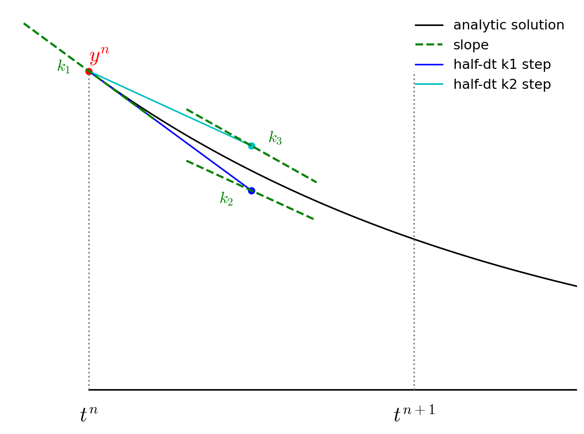

********************
Adaptive Runge-Kutta
********************

Previously we looked at the simple Euler and 2nd-order Runge-Kutta
methods for integration.  Now we will look at 4th order Runge-Kutta.
We will also:

* Write our integrator as a templated class that works with any
  ODE system of the form:

  .. math::

     \frac{d{\bf y}}{dt} = {\bf f}(t, {\bf y})

* Adapt the timestep taken internally to achieve a user-desired
  error in the solution.

4th order RK
============

The advance begins by estimating the derivatives (righthand side or slope) at time $t^n$.  We'll call this ${\bf k}_1$.

$${\bf k}_1 = {\bf f}(t^n, {\bf y}^n)$$

.. figure:: rk4_k1.png
   :align: center
   :width: 90%

We then follow the slope ${\bf k}_1$ to the midpoint in time, $t^{n+1/2}$ and evaluate the slope there.  We call the new slope ${\bf k}_2$.

$${\bf k}_2 = {\bf f}(t^n + \tau/2, {\bf y}^n + (\tau/2) {\bf k}_1)$$

.. figure:: rk4_k2.png
   :align: center
   :width: 90%

We then go back to the start, but this time follow the new slope,
${\bf k}_2$ to the midpoint in time, $t^{n+1/2}$.  We again evaluate the slope here, and call it ${\bf k}_3$.

$${\bf k}_3 = {\bf f}(t^n + \tau/2, {\bf y}^n + (\tau/2) {\bf k}_2)$$

Finally, we go back to the start and follow ${\bf k}_3$ for the full
timestep, to $t^{n+1}$ and evaluate the slope there, calling it ${\bf k}_4$.

$${\bf k}_4 = {\bf f}(t^n + \tau, {\bf y}^n + \tau {\bf k}_3)$$

.. figure:: rk4_k4.png
   :align: center
   :width: 90%

We then get the updated solution using a linear combination of the 4 slopes:

$${\bf y}^{n+1} = {\bf y}^n + \frac{\tau}{6} ({\bf k}_1 + 2 {\bf k}_2 + 2 {\bf k}_3 + {\bf k}_4)$$

.. figure:: rk4_final.png
   :align: center
   :width: 90%

Note the similarity of RK4 to Simpson's rule for integration.

Adaptive timesteps
==================

Implementation
==============

Here's the code:

.. literalinclude:: ../../examples/general_ODE_class/ode_integrator.H
   :language: c++
   :caption: ``ode_integrator.H``

