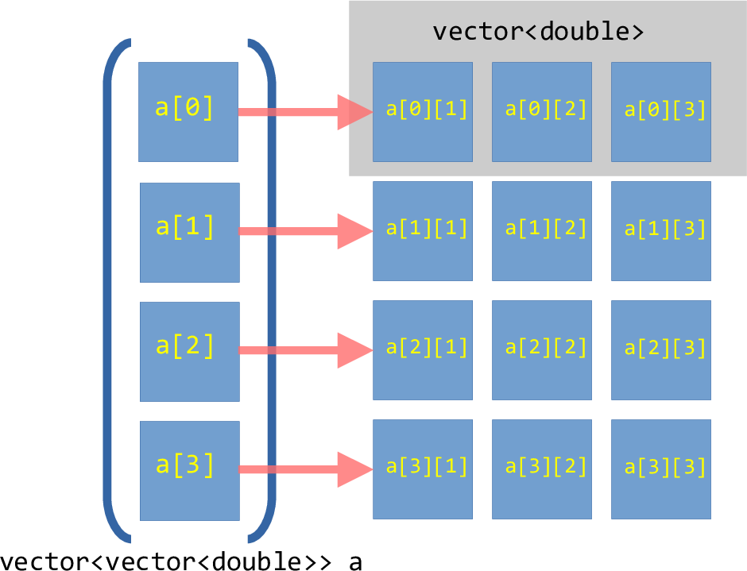
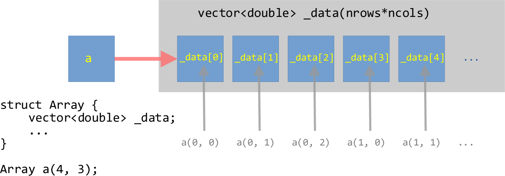

******************************************
Example: Multidimensional Contiguous Array
******************************************

.. admonition:: reading

   Your text does an example of a multi-dimensional array that is a
   ``vector`` of ``vector`` s.

   We are doing something different here -- we want the memory space
   to be fully contiguous, so we will create a 1-d memory space and create
   operators to index into it.

``vector``-of-``vector``'s
==========================

If we consider:

.. code:: c++

   std::vector<std::vector<double>> array_2d;

Then this is creating a 1-d array that corresponds to the rows of our
array, where each element of this is a separate vector to store the
columns that make up that row.  But each of those row vectors are independent,
and can be in very disparate positions in memory.

This can be visualized as:

   Illustration of a ``vector``-of-``vector``'s for a :math:`4\times
   3` array.

Our goal is to create a contiguous memory space that stores all the
elements of the 2-d array.

Contiguous multi-dimensional array
==================================

To make a contiguous vector, we will use a single ``vector``
dimensioned with a size of ``nrows * ncols`` (note: C++ will likely
have more elements than this, to allow for the potential expansion of
the vector, but we won't use that).

We will then overload the ``()`` operator to allow for us to index
into this one-dimensional buffer as ``a(nrow, ncol)``.

This can be visualized as:

   Illustration of a one-dimensional ``vector`` wrapped in a ``struct`` that can be
   indexed as a two-dimensional array.

Implementation
==============

We will implement the main ``struct`` in a header so we can reuse this

.. literalinclude:: ../../examples/contiguous_array/array.H
   :language: c++
   :caption: ``array.H``

Some comments on this implementation:

* We do not include the ``_data`` vector in the initialization-list,
  but instead explicitly resize it in the constructor.  This allows us
  to do an ``assert`` on the number of rows and columns before we try
  to resize it.

  The downside of this approach is that it might be a little slower,
  since we create the empty vector and then resize it in two steps
  instead of handling it all at initialization.

* We have two methods for the ``()`` operator.  The first is for the
  case of a non-``const`` declared ``Array`` and the second is for a
  ``const`` declared ``Array``.

The body of the ``Array`` methods is provided in a separate ``.cpp`` file:

.. literalinclude:: ../../examples/contiguous_array/array.cpp
   :language: c++
   :caption: ``array.cpp``

Here's a test program for the ``Array`` object.  Notice that we gain
access to the ``Array`` class via ``#include "array.H"``.

.. literalinclude:: ../../examples/contiguous_array/test_array.cpp
   :language: c++
   :caption: ``test_array.cpp``

Notice a few things:

* When we loop over the elements of the ``Array`` we get the number of
  rows via ``.nrows()`` and the number of columns via ``.ncols()``.

* For ``Array y``, we use a range-for loop over the elements of
  ``_data`` directly -- this is the one-dimensional representation of
  our array.  We can do this because the data is stored contiguously.

* When we try to index out of bounds, the ``assert`` statements catch
  this.

We have 3 files in our project: ``array.H``, ``array.cpp``, and ``test_array.cpp``.
We could compile and link these on our own as:

.. prompt:: bash

   g++ -c -I. array.cpp
   g++ -c -I. test_array.cpp
   g++ -o test_array array.o test_array.o

But that is a lot to do each time.  Instead, we'll use a makefile:

.. literalinclude:: ../../examples/contiguous_array/GNUmakefile
   :language: make
   :caption: ``GNUmakefile``

.. note::

   The ``GNUmakefile`` has some helpful features.  To just
   build as is, we can do:

   .. prompt:: bash

      make

   If we instead want to turn on the ``assert``'s, then we do:

   .. prompt:: bash

      make DEBUG=TRUE

   To force a rebuild, we can do:

   .. prompt:: bash

      make clean
      make

   The ``assert``'s are handled by the C++ via the ``NDEBUG`` preprocess
   directive, so setting ``-DNDEBUG`` tells the preprocessor to turn
   off the asserts.

This ``GNUmakefile`` is a little more complex than the previous ones
we looked at, since there are two possible targets defined.  The first
target, ``test_array`` in this case, is the default.

Performance
===========

Let's see how the speed of this compares to doing

.. code:: c++

   std::array<std::array<double, ncols>, nrows>

Here we access a simple clock via ``<chrono>`` and use it to time
different implementations.  We convert to seconds using
``CLOCKS_PER_SEC``.

.. literalinclude:: ../../examples/contiguous_array/timing.cpp
   :language: c++
   :caption: ``timing.cpp``

We can build this via:

.. prompt:: bash

   make timing

Some things to consider:

* Putting the ``operator()`` functions in ``array.H`` gives the
  compiler the opportunity to inline them.  This can have a big
  performance difference compared to putting their implementation in
  ``array.cpp``.

* Timing the array creation and loop will reveal that creating our
  ``Array`` is more expensive than the ``std::array<std::array<>>``
  approach.

* The ``std::array<std::array<>>`` is allocated on the stack, and we
  can quickly exceed the stack size.  Meanwhile, the ``Array`` class
  holds the data on the heap.

  Its size also needs to be known at compilation time.

.. admonition:: try it...

   How does the performance change with array size, compiler
   optimization level, asserts enabled, etc.?

