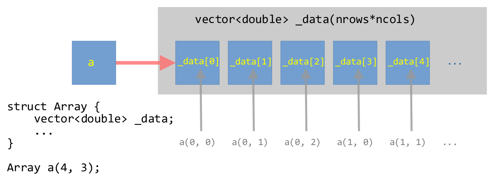

******************************************
Example: Multidimensional Contiguous Array
******************************************

.. admonition:: reading

   Your text does an example of a multi-dimensional array that is a
   ``vector`` of ``vector``.

   We are doing something different here---we want the memory space
   to be fully contiguous, so we will create a 1-d memory space and create
   operators to index into it.

``vector``-of-``vector``'s
==========================

If we consider:

.. code:: c++

   std::vector<std::vector<double>> array_2d;

Then this is creating a 1-d array that corresponds to the rows of our
array, where each element of this is a separate vector to store the
columns that make up that row.  But each of those row vectors are independent,
and can be in very disparate positions in memory.

This is essentially what we did previously as our :ref:`matrix container <sec:cxx_matrix>`.

This can be visualized as:

.. figure:: vector_of_vectors.png
   :align: center
   :width: 80%

   Illustration of a ``vector``-of-``vector``'s for a :math:`4\times
   3` array.

Contiguous multi-dimensional array
==================================

Our goal now is to create a contiguous memory space that stores all the
elements of the 2-d array.

To make a contiguous vector, we will use a single ``vector``
dimensioned with a size of ``nrows * ncols`` (note: C++ will likely
have more elements than this, to allow for the potential expansion of
the vector, but we won't use that).

We will then overload the ``()`` operator to allow for us to index
into this one-dimensional buffer as ``a(nrow, ncol)``.

This can be visualized as:

   Illustration of a one-dimensional ``vector`` wrapped in a ``struct`` that can be
   indexed as a two-dimensional array.

Implementation
==============

We will implement the main ``struct`` in a header so we can reuse this

.. literalinclude:: ../../examples/contiguous_array/array.H
   :language: c++
   :caption: ``array.H``

Some comments on this implementation:

* We need to order things in the initialization-list in the same order
  they appear as member data in the class.

* We include the ``_data`` vector in the initialization-list without
  worrying about if its size is zero---the ``assert`` in the
  function body do that for us.

* We have two member functions for the ``()`` operator.  The first is for the
  case of a non-``const`` declared ``Array`` and the second is for a
  ``const`` declared ``Array``.

Here's a test program for the ``Array`` object.  Notice that we gain
access to the ``Array`` class via ``#include "array.H"``.

.. literalinclude:: ../../examples/contiguous_array/test_array.cpp
   :language: c++
   :caption: ``test_array.cpp``

Notice a few things:

* When we loop over the elements of the ``Array`` we get the number of
  rows via ``.nrows()`` and the number of columns via ``.ncols()``.
  Technically these are of type ``std::size_t`` (which is some form
  of an ``unsigned int``).

* For ``Array y``, we use a range-for loop over the elements of
  ``_data`` directly---this is the one-dimensional representation of
  our array.  We can do this because the data is stored contiguously.

  Note though---this breaks the idea of encapsulation in a class, since
  we are accessing this data directly.

* When we try to index out of bounds, the ``assert`` statements catch
  this.

Here's a makefile that builds this test program + a few others that
we'll compare with.

.. literalinclude:: ../../examples/contiguous_array/GNUmakefile
   :language: make
   :caption: ``GNUmakefile``

.. note::

   The ``GNUmakefile`` has some helpful features.  To just
   build as is, we can do:

   .. prompt:: bash

      make

   If we instead want to turn on the ``assert``'s, then we do:

   .. prompt:: bash

      make DEBUG=TRUE

   To force a rebuild, we can do:

   .. prompt:: bash

      make clean
      make

   The ``assert``'s are handled by the C++ via the ``NDEBUG`` preprocessor
   directive, so setting ``-DNDEBUG`` tells the preprocessor to turn
   off the asserts.

This ``GNUmakefile`` is a little more complex than the previous ones
we looked at, since there are several possible targets defined.  The first
target, ``test_array`` in this case, is the default.  The other two targets
will be discussed below.

.. admonition:: try it...

   Let's add ``.min()`` and ``.max()`` member functions to the class to
   return the minimum and maximum element in the array respectively.

   .. dropdown:: solution

      .. literalinclude:: ../../examples/contiguous_array/array_new.H
         :language: c++
         :caption: new ``array.H``
         :emphasize-lines: 7, 53-67

.. admonition:: try it...

   What would we need to change if we wanted to make this a ``class``
   instead of a ``struct``?

Performance
===========

Let's see how the speed of this compares to doing

.. code:: c++

   std::array<std::array<double, ncols>, nrows>

This needs the size known at compile time, and the array in this case
is allocated on the *stack* instead of the *heap*.  This means that it
is likely we will have a stack overflow if we make the array too big.

.. tip::

   Here we access a simple clock via ``<chrono>`` by calling
   ``clock()`` and use it to time different implementations.

   We need to call ``clock()`` before and after the code block we are
   timing to remove any offset in the time returned by ``clock()``.  We
   convert to seconds using ``CLOCKS_PER_SEC``.

.. literalinclude:: ../../examples/contiguous_array/timing.cpp
   :language: c++
   :caption: ``timing.cpp``

We can build this via:

.. prompt:: bash

   make timing

Some things to consider:

* Putting the ``operator()`` functions in ``array.H`` gives the
  compiler the opportunity to inline them.  This can have a big
  performance difference compared to putting their implementation in
  a separate C++ file.

* We are not timing the array creation.  It is likely that creating
  our ``Array`` is more expensive than the
  ``std::array<std::array<>>`` approach.

* The ``std::array<std::array<>>`` is allocated on the stack, and we
  can quickly exceed the stack size.  Meanwhile, the ``Array`` class
  holds the data on the heap.

.. admonition:: try it...

   How does the performance change with array size, compiler
   optimization level, asserts enabled, etc.?

Finally, we can compare to a Fortran implementation:

.. literalinclude:: ../../examples/contiguous_array/fortran_array.f90
   :language: fortran
   :caption: ``fortran_array.f90``

which we can build via

.. prompt:: bash

   make fortran_array

