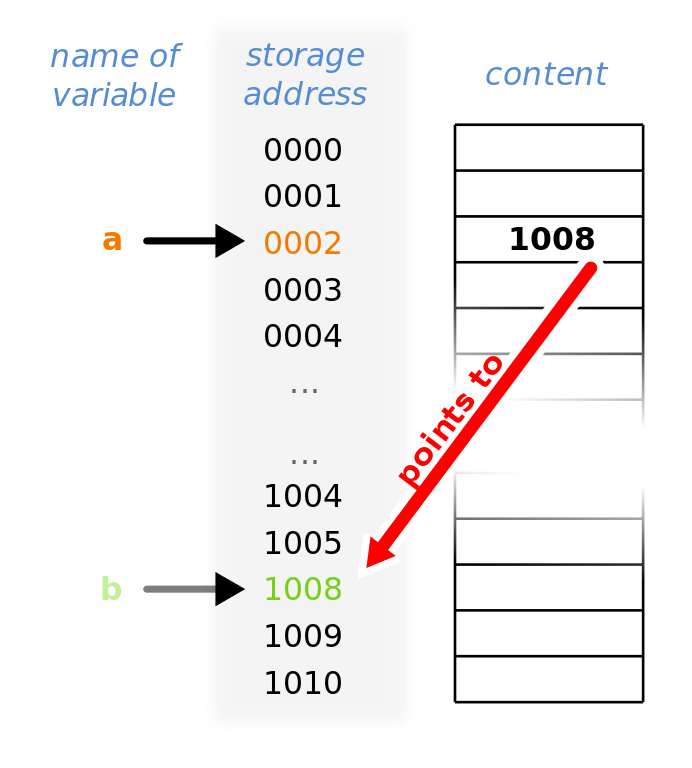

********
Pointers
********

.. admonition:: reading

   Cyganek section 3.12

Pointers are similar to references in that they provide indirect access to an object's data.
However, in C++, references are much more widely used than pointers.

.. note::

   References and pointers can provide similar functionality.  In
   general, pointers are more general but also more error-prone.
   Here's a summary of the `differences between references and
   pointers
   <https://en.wikipedia.org/wiki/Reference_(C%2B%2B)#Relationship_to_pointers>`_

Here's a simple example:

.. code:: c++

   int *a;
   int b;

   a = &b;

This has the pointer ``a`` point to the memory location of ``b`` (we
use the *address operator* ``&`` here).  Visually, this appears as:

   A pointer, ``a`` that points to the memory location of variable ``b``.

   (Wikipedia/Sven)

We can access the data pointed to by the pointer by using the *dereference operator*, ``*``.
Here's an example:

.. literalinclude:: ../../examples/pointers/pointers_example.cpp
   :language: c++

.. note::

   We will not use pointers directly much in this class, but they are
   useful for managing memory.  Later (if there is time) we'll see
   that there are *smart pointers* in C++ that handle a lot of the
   memory management for us.

.. tip::

   It is a good idea to initialize all pointers (just like we do for
   all other object types).  C++ provides ``nullptr`` for this reason:

   .. code:: c++

      int *p = nullptr;

   This then allows us to use the pointer in a conditional, like:

   .. code:: c++

      if (p) {
          // do stuff
      }

.. admonition:: try it...

   What happens if we compare two pointers with ``==``?

