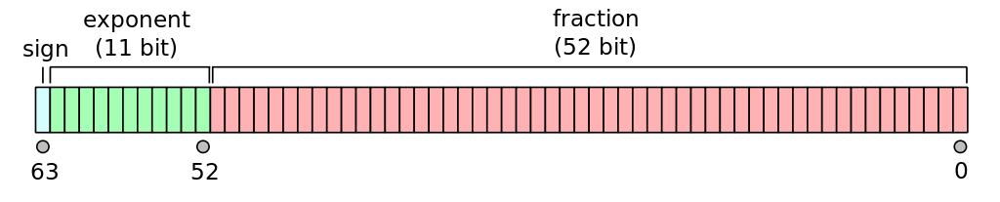
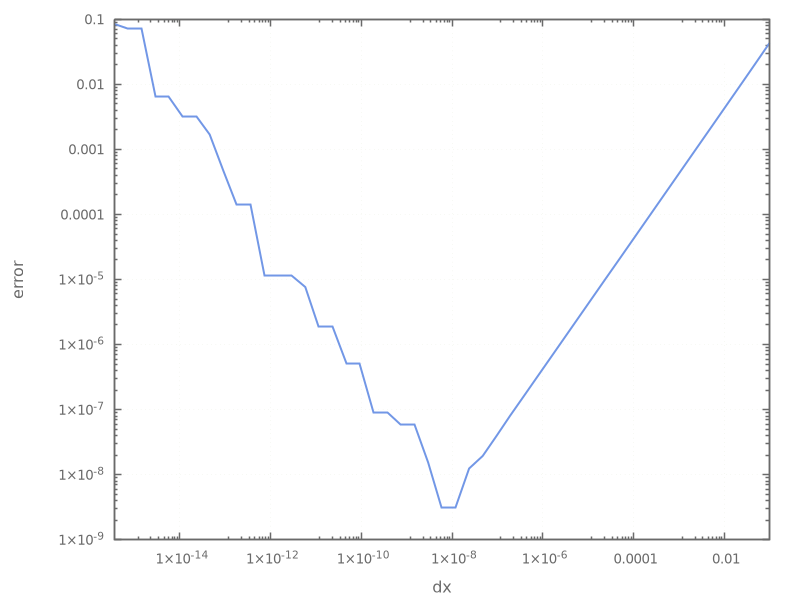

**************
Floating Point
**************

.. admonition:: reading

   `What Every Computer Scientist Should Know About Floating-Point Arithmetic <https://dl.acm.org/doi/10.1145/103162.103163>`_

Storage overview
================

We can think of a floating point number as having the form:

.. math::

   \mbox{significand} \times 10^\mbox{exponent}

Most computers follow the IEEE 754 standard for floating point, and we commonly work
with 32-bit and 64-bit floating point numbers (single and double precision).  These bits
are split between the signifcand and exponent as well as a single bit for the sign:

   (source: wikipedia)

Since the number is stored in binary, we can think about expanding a number in powers of 2:

.. math::

   0.1 \sim (1 +
             1 \cdot 2^{-1} +
             0 \cdot 2^{-2} +
             0 \cdot 2^{-3} +
             1 \cdot 2^{-4} +
             1 \cdot 2^{-5} + \ldots) \times 2^{-4}

In fact, ``0.1`` cannot be exactly represented in floating point:

.. literalinclude:: ../../examples/floating_point/simple_roundoff.cpp
   :language: c++
   :caption: ``simple_roundoff.cpp``

Precision
---------

With 52 bits for the significand, the smallest number compared to ``1`` we can represent is

.. math::

   2^{-52} \approx 2.22\times 10^{-16}

but the IEEE 754 format always expresses the significant such that the
first bit is ``1`` (by adjusting the exponent) and then doesn't need
to store that ``1``, giving us an extra bit of precision, so the
machine epsilon is

.. math::

   2^{-53} \approx 1.11\times 10^{-16}

We already saw how to access the limits of the data type via
``std::numeric_limits``. When we looked at *machine epsilon*, we saw that for a
``double`` it was about :math:`1.1\times 10^{-16}``.

Note that this is a relative error, so for a number like ``1000`` we could only add
``1.1e-13`` to it before it became indistinguishable from ``1000``.

.. math::

   \mbox{relative roundoff error} = \frac{|\mbox{true number} - \mbox{computer representation} |}
      {|\mbox{true number}|} \le \epsilon

Note that there are `varying definitions of machine epsilon <https://en.wikipedia.org/wiki/Machine_epsilon#Mainstream_definition_(Interval_machine_epsilon)>`_ which differ by a factor of 2.

Range
-----

Now consider the exponent, we use 11 bits to store it in double
precision.  Two are reserved for special numbers, so out of the 2048
possible exponent values, one is 0, and 2 are reserved, leaving 2045
to split between positive and negative exponents.  These are set as:

.. math::

   2^{-1022} \mbox{ to } 2^{1023}

converting to base 10, this is

.. math::

   \sim 10^{-308} \mbox{ to } \sim 10^{308}

Reporting values
----------------

We can use ``std::numeric_limits<double>`` to query these floating point properties:

.. literalinclude:: ../../examples/floating_point/limits.cpp
   :language: c++
   :caption: ``limits.cpp``

Roundoff vs. truncation error
==============================

Consider the Taylor expansion of :math:`f(x)` about some point :math:`x_0`:

.. math::

   f(x) = f(x_0 + \Delta x) = f(x_0) + \left . \frac{df}{dx} \right |_{x_0} \Delta x + \mathcal{O}(\Delta x^2)

where :math:`\Delta x = x - x_0`

We can solve for the derivative to find an approximation for the first derivative:

.. math::

   \left . \frac{df}{dx} \right |_{x_0} = \frac{f(x_0 + \Delta x) - f(x_0)}{\Delta x} + \mathcal{O}(\Delta x)

This shows that this approximation for the derivative is first-order accurate in :math:`\Delta x`---that is the truncation error of the approximation.

We can see the relative size of roundoff and truncation error by using this approximation
to compute a derivative for different values of :math:`\Delta x`:

.. literalinclude:: ../../examples/floating_point/truncation_vs_roundoff.cpp
   :language: c++
   :caption: ``truncation_vs_roundoff.cpp``

It is easier to see the behavior if we make a plot of the output:

Let's discuss the trends:

* Starting with the largest value of :math:`\Delta x`, as
  we make :math:`\Delta x` smaller, we see that the error decreases.
  This is following the expected behavior of the truncation error
  derived above.

* Once our :math:`\Delta x` becomes really small, roundoff error starts
  to dominate.  In effect, we are seeing that:

  .. math::

     (x_0 + \Delta x) - x_0 \ne 0

  because of roundoff error.

* The minimum error here is around :math:`\sqrt{\epsilon}`, where :math:`\epsilon` is
  machine epsilon.

Testing for equality
====================

Because of roundoff error, we should never exactly compare two floating point numbers,
but instead ask they they agree within some tolerance, e.g., test equality as:

.. math::

   | x - y | < \epsilon

For example:

.. literalinclude:: ../../examples/floating_point/comparing.cpp
   :language: c++
   :caption: ``comparing.cpp``

Minimizing roundoff
===================

Consider subtracting the square of two numbers---taking the difference of two very close-in-value numbers is a prime place where roundoff can come into play.

Instead of doing:

.. math::

   x^2 - y^2

we can instead do:

.. math::

   (x - y)(x + y)

by factoring this, we are subtracting more reasonably sized numbers, reducing the roundoff.

We can see this directly by doing this with single precision (`float`) and comparing to an answer computed via double precious (`double`)

Here's an example:

.. literalinclude:: ../../examples/floating_point/subtraction.cpp
   :language: c++
   :caption: ``subtraction.cpp``

As another example, consider computing [#f1]_:

.. math::

   \sqrt{x + 1} - \sqrt{x}

We can alternately rewrite this to avoid the subtraction of two close numbers:

.. math::

   \sqrt{x + 1} - \sqrt{x} = (\sqrt{x + 1} - \sqrt{x})
        \left ( \frac{\sqrt{x+1} + \sqrt{x}}{\sqrt{x+1} + \sqrt{x}} \right )
        = \frac{1}{\sqrt{x+1} + \sqrt{x}}

Again we'll compare a single-precision calculation using each of these methods
to a double precision "correct answer".  To ensure that we use the
single-precision version of the ``std::sqrt()`` function, we will use single
precision literal suffix, e.g., ``1.0f`` tells the compiler that this is a
single-precision constant.

.. literalinclude:: ../../examples/floating_point/squareroots.cpp
   :language: c++
   :caption: ``squareroots.cpp``

Notice that we get several more significant digits correct when we compute it with
the second formulation compared to the original form.

Summation algorithms
--------------------

Summing a sequence of numbers is a common place where roundoff error
comes into play, especially if the numbers all vary in magnitude and
you do not attempt to add them in a sorted fashion.  There are a
number of different summation algorithms that keep track of the loss
due to roundoff and compensate the sum, for example `the Kahan summation algorithm <https://en.wikipedia.org/wiki/Kahan_summation_algorithm#See_also>`_.

Special numbers
===============

IEEE 754 defines a few special quantities:

* ``NaN`` (not a number) is the result of ``0.0/0.0`` or ``std::sqrt(-1.0)``

* ``Inf`` (infinity) is the result of ``1.0/0.0``

* ``-0`` is a valid number and the standard says that ``-0`` is equivalent to ``0``

----

.. [#f1] this example is based on Yakowitz & Szidarovszky
