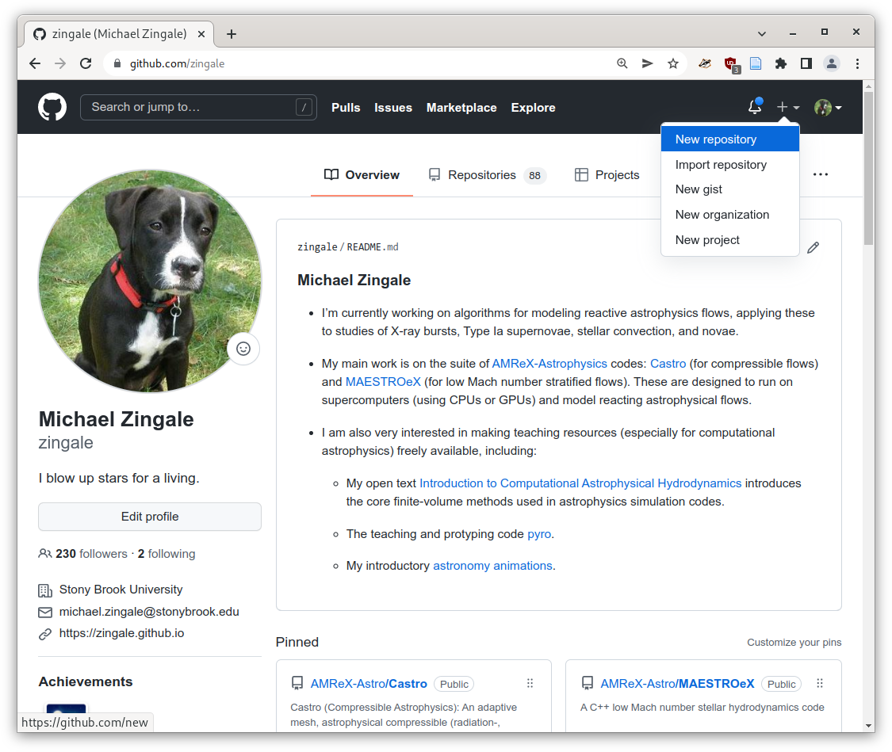
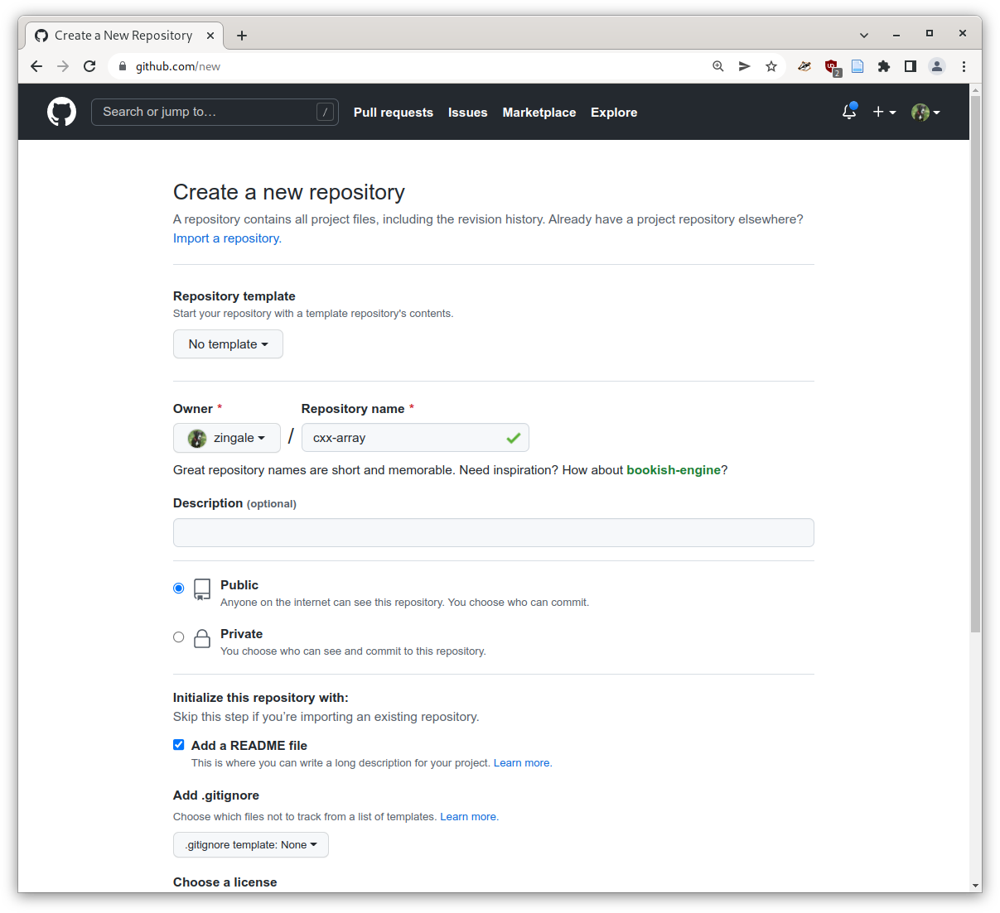
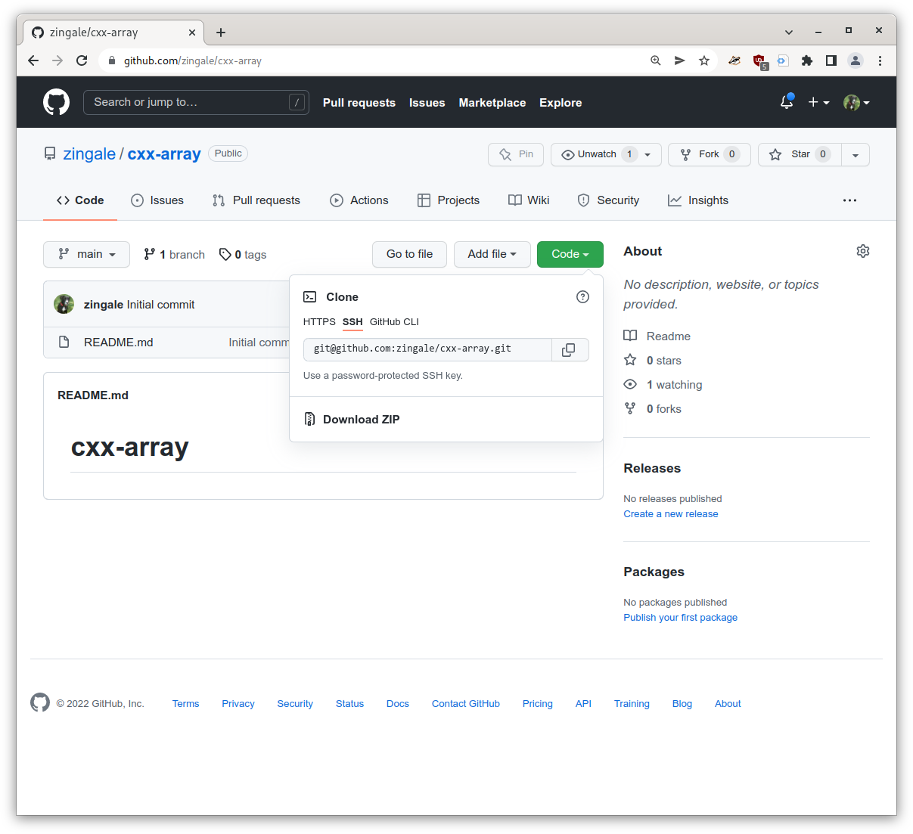
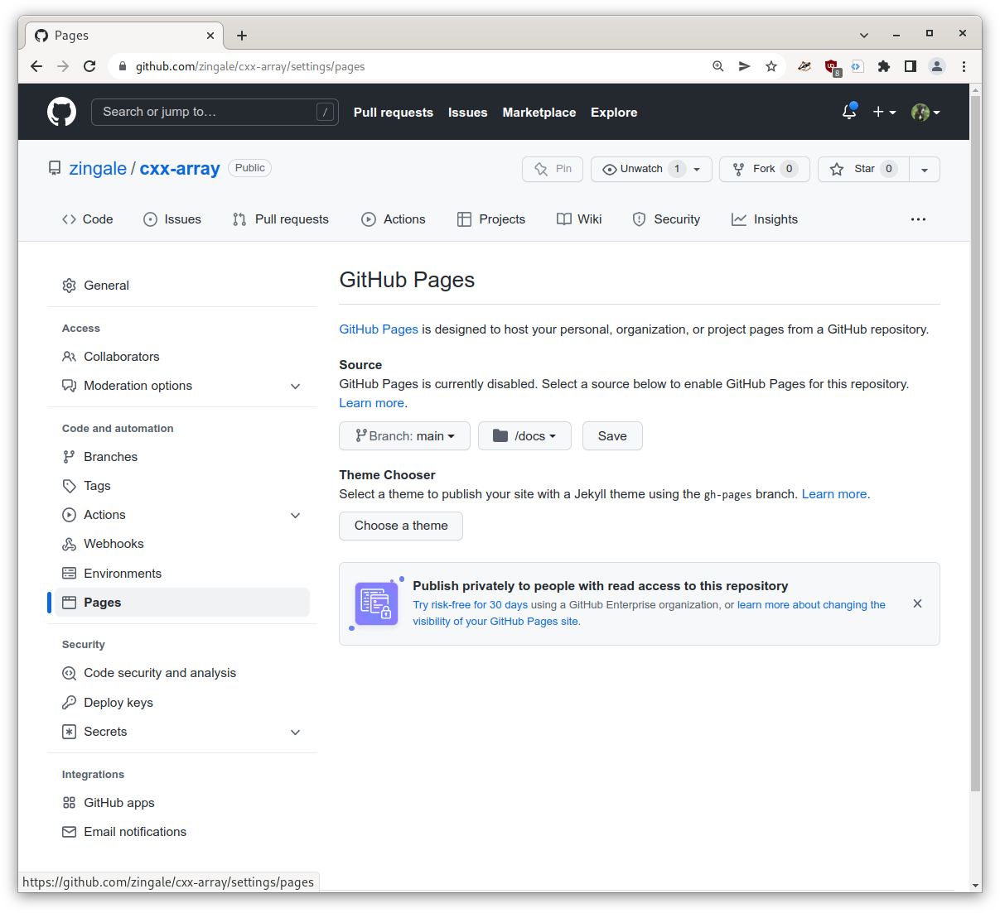

************
Github Pages
************

`Github Pages <https://pages.github.com/>`_ allows us to host a webpage
directly on github.  Often we do this in our project repo itself, so
we keep the code and documentation / webpage all in one place.

Let's learn how to host our webpage on github.  First lets create a
new repository:

We'll work on building documentation for our array class, so let's
name this project ``cxx-array`` and check the ``add README`` option.
Keep everything else the same:

Now we can clone the repo on our local machine by finding the location
under the "code" button:

We would do:

.. prompt:: bash

   git clone git@github.com:<username>/cxx-array.git

(where you replace ``<username>`` with your github username to get your
repo.

Now go to the *settings* for this repo and go to the *Pages* settings
and enable github pages for ``main`` in the ``/docs`` directory.  And
click *save*.

Now in our cloned repository, we need to create the ``docs/`` directory
and put our initial page there.

Now we can view our page:

https://zingale.github.io/cxx-array/

