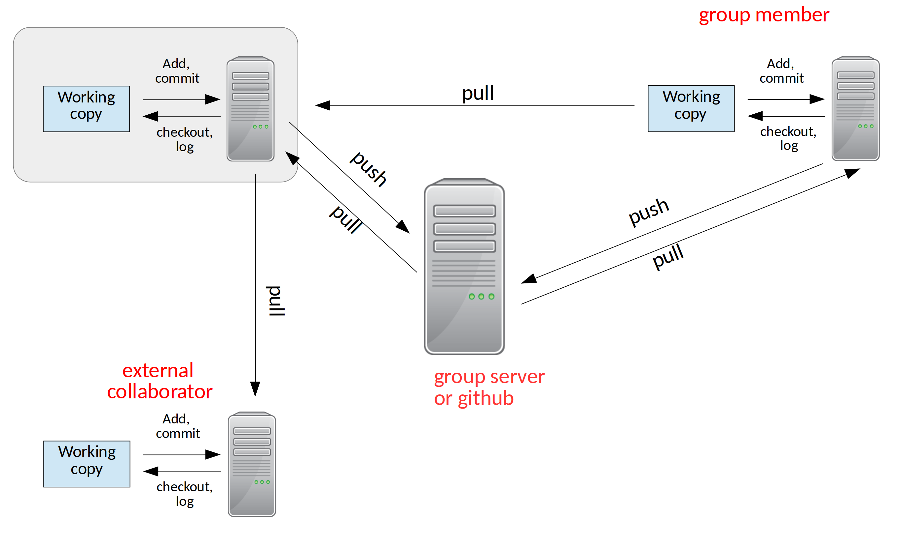

******
github
******

Bare Repository
===============

So far, we've just been using our git repo for ourselves.

Let's look back at the figure illustrating ways we can share with distributed version control:

When multiple developers are working on the same code together, it is
convenient to have a central repository that everyone can communicate
with.

We use a special ``bare`` repository for this purpose.  A bare repo
has all of the metadata for the project, but we don't work directly in
it.  This way we avoid the risk of having unsaved changed in the repo
that other people are using to synchronize with.

Let's create a bare repo from our ``project2`` project.  From your home directory
(assuming that project2 is ``~/project2/``, we do:

.. prompt:: bash

   git clone --bare project2

Now we see a new directory ``project2.git``.

A First Example of Collaboration
================================

Let's pretend we are a different user.  Let's make a directory for our pretend user and clone our project:

.. prompt:: bash

   cd ~
   mkdir newuser
   cd newuser
   git clone ~/project2.git

The ``clone`` command make a new git repo for our user called ``project2/``

If we do a ``git log`` in it, we'll see the whole history we had from
our earlier work.

Now, this repo knows where it was cloned from, through a concept
called *remotes*.  A remote is a repo (usually a bare repo) that we
communicate with the share our changes (a *push*) of get changes from
other users (a *pull*).  We can see our remote by doing:

.. prompt:: bash

   git remote -v

We'll see something like:

.. code::

   origin	/home/campus.stonybrook.edu/mzingale/project2.git (fetch)
   origin	/home/campus.stonybrook.edu/mzingale/project2.git (push)

