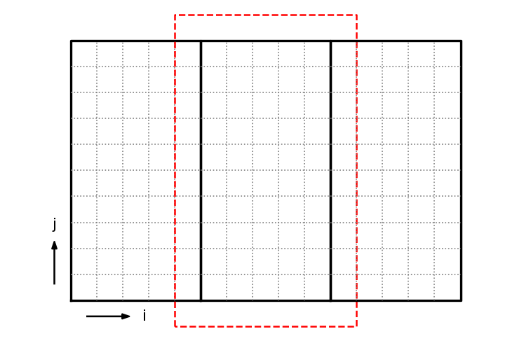

*****************************
MPI Linear Advection Equation
*****************************

Let's look at a very crude way to solve the linear advection equation in two-dimensions:

$$a_t + u a_x + v a_y = 0$$

We will do a very simple, first-order accurate discretization:

.. math::

  \frac{a^{n+1}_{i,j} - a^n_{i,j}}{\Delta t} =
          - u \frac{a^n_{i,j} - a^n_{i-1,j}}{\Delta x}
          - v \frac{a^n_{i,j} - a^n_{i,j-1}}{\Delta y}

This discretization assumes that $u > 0$ and $v > 0$.  In that case, it is *upwinded*.

.. note::

   This is only stable for $\mathcal{C} < 1/2$, where

   .. math::

      \mathcal{C} = \max \left \{ \frac{u \Delta t}{\Delta x}, \frac{v \Delta t}{\Delta y} \right \}

.. warning::

   This is a very bad discretization of advection.  Our concern here
   is not on the accuracy of the method, but to demonstrate how to do
   the domain decomposition.  For better methods for advection, see
   `my lecture notes on advection <https://zingale.github.io/computational_astrophysics/advection/advection-intro.html>`_.

The solution to the linear advection equation is to take what ever the initial
$a(x, y)$ is and move it with a speed $(u, v)$ with the shape unchanged.

We'll use periodic boundary conditions and advect for a period, after which
the solution should be identical to the initial conditions.  Any differences
are due to numerical (truncation) error in our discretization.

.. tip::

   You can get all the code for this example here:
   https://github.com/zingale/phy504/tree/main/examples/parallel/mpi/advect

Domain decomposition
====================

We will divide our domain along the x-direction:

Each MPI process will manage their own subdomain.  To make things
easier, we will refer to a global index space on the entire domain.

For the figure above, the indices of the grids, (``ilo``, ``ihi``, ``jlo``, ``jhi``) are:

* left grid: (``0``, ``5``, ``0``, ``9``)

* middle grid: (``5``, ``9``, ``0``, ``9``)

* right grid: (``10``, ``14``, ``0``, ``9``)

Each of these grids will be managed by a separate MPI task.  To deal
with the boundaries of each grid, we will have a perimeter of ghost
cells, shown as the red outline for the middle grid.  We will use MPI
send/recv to exchange data with the neighboring grids to fill these
ghost cells.

For the physical boundaries, we will assume we are periodic.

``Array``
=========

We want a version of our ``Array`` class that can
start at an arbitrary index, e.g., for the middle grid above (excluding ghost cells):

.. code:: c++

   Array a(5, 9, 0, 9)

This is easy to do by adapting our existing ``Array`` class to include an offset:

.. literalinclude:: ../../examples/parallel/mpi/advect/array.H
   :language: c++
   :caption: ``array.H``

``Grid``
========

We will manage each processor's subdomain with a ``grid`` class.  This class
takes the domain size and number of points as well as each MPI processes rank
and the total number of MPI processes and computes the domain decomposition
for each rank.

It also has a method to generate an array allocated for that rank, including
ghost cells.

.. literalinclude:: ../../examples/parallel/mpi/advect/grid.H
   :language: c++
   :caption: ``grid.H``

Main program driver
===================

The main program driver is pretty simple:

* Create the grid on each MPI process

* Set the initial conditions

* Loop until we reach the final time

  * Compute the timestep

  * Fill the ghost cells

  * Update $a$ to the new time solution

* Output the solution

Here's the code:

.. literalinclude:: ../../examples/parallel/mpi/advect/advection.cpp
   :language: c++
   :caption: ``advection.cpp``

There are two places where MPI communication comes into play---the
ghost cell filling and the outputting.

Ghost cell filling
==================

For the ghost cell filling, each processor has a subdomain in an
array, ``a``.  We need to fill ``a(ilo-1, :)`` by receiving data from the left, and in exchange, we need to pass ``a(ilo, :)`` to the left to fill the left process's ``a(ihi+1, :)``.

Our domain decomposition is done such that we are continguous in the ``j`` index, that means
that we can specify the start of the column of data corresponding to ``ilo-1`` as ``a(ilo-1, jlo-ng)``
and then using the MPI call to send the entire column of elements.

There are two ``MPI_Sendrecv`` calls, one for the left and the other for the right.

.. literalinclude:: ../../examples/parallel/mpi/advect/ghost_fill.H
   :language: c++
   :caption: ``ghost_fill.H``

Outputting
==========

Only rank ``0`` will output, so we need to move the data from all the other
ranks to rank ``0``.  This is called serial I/O.  We just output the data
one cell per line, with an empty line between rows.  This can be read into
``gnuplot`` easily.

.. literalinclude:: ../../examples/parallel/mpi/advect/output.H
   :language: c++
   :caption: ``output.H``

Initialization
==============

We will do a simple smooth Gaussian as the initial conditions.

.. literalinclude:: ../../examples/parallel/mpi/advect/initialize.H
   :language: c++
   :caption: ``initialize.H``

Running
=======

Here's a ``GNUmakefile``:

.. literalinclude:: ../../examples/parallel/mpi/advect/GNUmakefile
   :language: make
   :caption: ``GNUmakefile``

.. note::

   I am using C++20 here, because I wanted to use ``std::print()`` and ``std::format()``.

The code can be executed as:

.. prompt:: bash

   mpiexec -n 4 ./advection

To plot the output, we can do:

.. literalinclude:: ../../examples/parallel/mpi/advect/plot.gp
   :language: gnuplot
   :caption: ``plot.gp``

