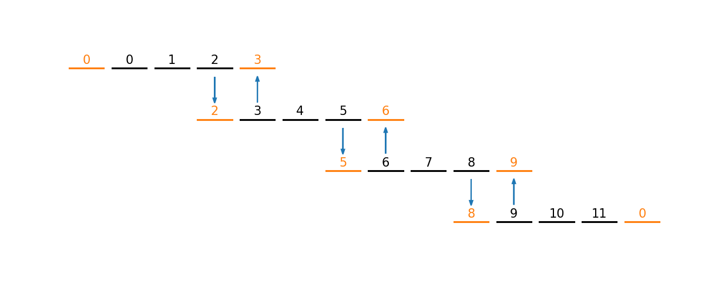

********************
MPI Send and Receive
********************

The main concept in MPI is sending messages between processes.  Two
basic functions: ``MPI_Send()`` and ``MPI_Recv()`` provide this
functionality.  You provide a buffer that contains the data you want
to send / receive.

* ``MPI_Send()`` and ``MPI_Recv()`` are a *blocking* send/receive.

* For the sending code, the program resumes when it is safe to reuse
  the buffer.

* For the receiving code, the program resumes when the message was received.

This may cause network contention if the destination process is busy
doing its own communication.  There are non-blocking sends that we can use
in this case.

Basic example
=============

Here's a basic example that mimics the *ghost cell filling* process used 
in hydrodynamics codes.

#. On each processor we allocate an integer vector of 5 elements

#. We fill the middle 3 element with a sequence based on the processor number.
   Processor 0 gets ``0, 1, 2``, processor 1 gets ``3, 4, 5``, and so on.

#. We send messages to the left and right element with the corresponding
   element from the neighboring processors.

This looks like:

   Sharing data at the boundary of our vectors

Here's the implementation:

.. literalinclude:: ../../examples/parallel/mpi/sendrecv_pairs.cpp
   :language: c++
   :caption: ``sendrecv_pairs.cpp``

Notice that at the two ends, we don't send anything in one case (for
processor 0, there is no left, and for processor :math:`N-1`, there is
no right).

