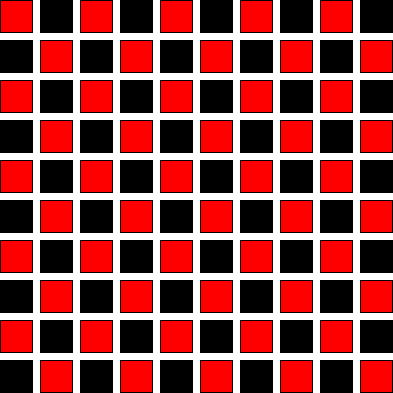

*************************
OpenMP Poisson Relaxation
*************************

Let's extend our 2d implementation of the Poisson solver to work with
OpenMP.  Most of the work is in the smoothing / relaxation routine, so
we will tackle that first.

We did Gauss-Seidel relaxation -- this means that we use the new
values of :math:`\phi_{i,j}` as soon as they become available.  If we
parallelize the loops using OpenMP, then there is a risk that while we
are updating a point on one thread another thread will be reading it
to use it in its update.  This is a *race condition*.  We need to
avoid these.

If we look at the 2-d update, it has the form:

.. math::

   \phi_{i,j} = \frac{1}{2} \frac{\Delta x^2 \Delta y^2}{\Delta x^2 + \Delta y^2}
            \left [ \frac{1}{\Delta x^2} (\phi_{i-1,j} + \phi_{i+1,j} ) +
                    \frac{1}{\Delta y^2} (\phi_{i,j-1} + \phi_{i,j+1} ) - f_{i,j} \right ]

We see that the update of :math:`\phi_{i,j}` depends only on the
values above, below, and to the left and right.  We can visualize this
as a checkerboard:

The update of the red points depends only on the black points and vice
versa.  This means that we can split the update into two separate
passed -- first updating the red points and then the black.  This is
called *red-black Gauss-Seidel*.

Here's what this code looks like:

.. code:: c++

   double fac = dx * dx * dy * dy / (dx * dx + dy * dy);
   double dx2i = 1.0 / (dx * dx);
   double dy2i = 1.0 / (dy * dy);

   for (int n = 0; n < n_smooth; ++n) {

       #pragma omp parallel
       {
           #pragma omp for
           for (int i = 1; i < nx-1; ++i) {
               int offset = i % 2;
               for (int j = 1 + offset; j < ny-1; j += 2) {
                   phi(i,j) = 0.5 * fac * (dx2i * (phi(i-1,j) + phi(i+1,j)) +
                                           dy2i * (phi(i,j-1) + phi(i,j+1)) - f(i,j));
               }
           }

           #pragma omp for
           for (int i = 1; i < nx-1; ++i) {
               int offset = (i + 1) % 2;
               for (int j = 1 + offset; j < ny-1; j += 2) {
                   phi(i,j) = 0.5 * fac * (dx2i * (phi(i-1,j) + phi(i+1,j)) +
                                           dy2i * (phi(i,j-1) + phi(i,j+1)) - f(i,j));
               }
           }
       }  // openmp
   }

We have a single parallel region and then 2 separate parallel for
loops.  There is an implicit "wait" after each loop, so we ensure that
all threads reach the end before going onto the next loop.

The only other routine that requires a little care is ``norm``, since
we have a reduction there, but we can handle this in the same way we
did previously.

Here's the full implementation:

.. literalinclude:: ../../examples/parallel/openmp/poisson/poisson2d.H
   :language: c++
   :caption: ``poisson2d.H``

and a driver:

.. literalinclude:: ../../examples/parallel/openmp/poisson/poisson.cpp
   :language: c++
   :caption: ``poisson.cpp``

We can compile this as:

.. prompt:: bash

   g++ -fopenmp -o poisson poisson.cpp

On my computer (with 8 cores) running with :math:`128^2` gives:

===================  ========
``OMP_NUM_THREADS``  time (s)
===================  ========
1                     20.710
2                     10.421
4                      5.709
8                      2.951
===================  ========
