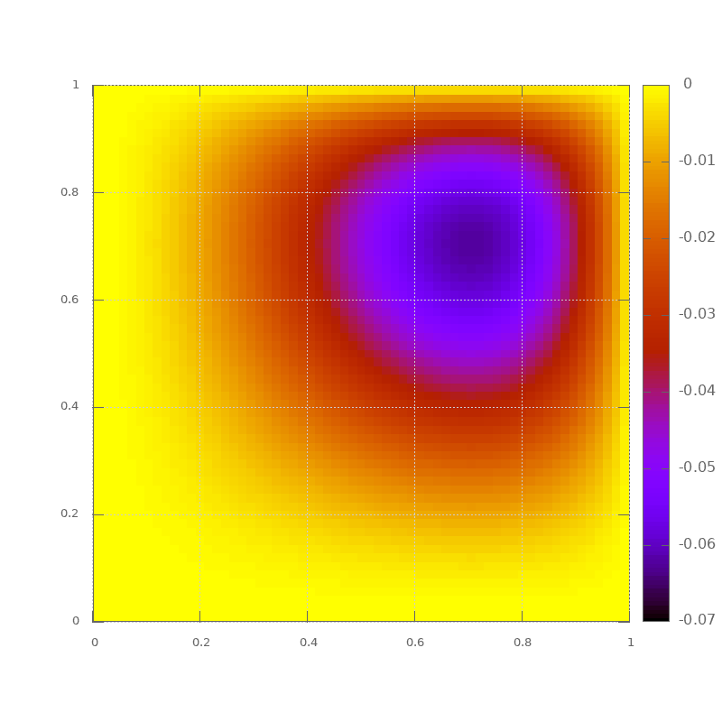

*******************************
Poisson Equation and Relaxation
*******************************

We want to solve the Poisson equation:

.. math::

   \nabla^2 \phi = f

We'll do it in 1-d, writing our equation as:

.. math::

   \frac{d^2 \phi}{dx^2} = f

on a domain :math:`[a, b]`.

.. note::

   This is a second-order PDE, so we need 2 boundary conditions.

We'll use `Dirichlet boundary conditions <https://en.wikipedia.org/wiki/Dirichlet_boundary_condition>`_:

.. math::

   \phi(a) = A

.. math::

   \phi(b) = B

Discretization
==============

We will represent :math:`\phi` and :math:`f` on a 1-d uniform grid, with $N$ points
ranging from $0, \ldots, N-1$:

.. figure:: fd_grid_bnd.png
   :align: center

   Our 1-d finite difference grid

Here we represent the discrete value of :math:`\phi` with a subscript:

.. math::

   \phi_i = \phi(x_i)

and similarly for :math:`f_i`.

Notice that with this grid we have a point on each boundary.  We will set these points to the boundary conditions:

.. math::

   \phi_0 = A

.. math::

   \phi_{N-1} = B

We now discretize the Poisson equation.  Let's start with the Taylor
expansions for :math:`\phi_{i+1}` and :math:`\phi_{i-1}`:

.. math::

   \phi_{i\pm 1} = \phi_i \pm \left . \frac{d\phi}{dx} \right |_i \Delta x
      + \frac{1}{2} \left . \frac{d^2\phi}{dx^2} \right |_i \Delta x^2
      \pm \frac{1}{6} \left . \frac{d^3\phi}{dx^3} \right |_i \Delta x^3 + \mathcal{O}(\Delta x^4)

adding :math:`\phi_{i+1}` and :math:`\phi_{i-1}`, we get:

.. math::

   \phi_{i+1} + \phi_{i-1} = 2 \phi_i + \left . \frac{d^2\phi}{dx^2} \right |_i (\Delta x^2) + \mathcal{O}(\Delta x^4)

which we can solve for:

.. math::

   \left . \frac{d^2\phi}{dx^2} \right |_i = \frac{\phi_{i+1} - 2 \phi_i + \phi_{i-1}}{\Delta x^2}  + \mathcal{O}(\Delta x^2)

This shows that our approximation to the second derivative is second-order accurate.  We can
then write the discrete Poisson equation as:

.. math::

   \frac{\phi_{i+1} - 2 \phi_i + \phi_{i-1}}{\Delta x^2} = f_i

Since the boundary values are fixed, for a grid of :math:`N` points, we need to
update the points :math:`1, \ldots, N-2` using this expression.

.. note::

   `Neumann boundary conditions <https://en.wikipedia.org/wiki/Neumann_boundary_condition>`_ are more complicated.  If we want $\phi^\prime(a) = 0$,
   then we use a second-order approximation to the derivative and a *ghost point*
   just outside the domain:

   .. math::

      \frac{\phi_1 - \phi_{-1}}{2\Delta x} = 0

   we also know from the Poisson equation:

   .. math::

      \frac{\phi_1 - 2\phi_0 + \phi_{-1}}{\Delta x^2} = f_0

   Together these can be used to eliminate $\phi_{-1}$ and give us
   an expression to use for $\phi_0$:

   .. math::

      \phi_0 = \phi_1 - \frac{\Delta x^2}{2} f_0

Relaxation
==========

We can solve for the update for a single zone:

.. math::

   \phi_i = \frac{1}{2} (\phi_{i+1} + \phi_{i-1} - \Delta x^2 f_i)

Our solution procedure is to iteratively apply this, updating the
values :math:`\phi_i` as we go along.  This process is called
*relaxation* or *smoothing* and the approach we will use, where we
use the new information immediately as it becomes available is called
`Gauss-Seidel relaxation <https://en.wikipedia.org/wiki/Gauss%E2%80%93Seidel_method>`_.

Stopping
========

We need a measure to determine when we should stop relaxing the solution.  We define
the *residual*, :math:`r`, as:

.. math::

   r_i =    \frac{\phi_{i+1} - 2 \phi_i + \phi_{i-1}}{\Delta x^2} - f_i

This is a measure of how we'll we satisfy the discrete equation.

We will keep iterating until the norm of the residual is small
compared to the norm of the source:

.. math::

   \| r \| < \epsilon \| f \|

Once that is satisfied, then we have solved the problem as well as we
can do with the number of points we are using in the discretization.

This requires us to define a vector norm.  We'll use the L2 norm:

.. math::

   \| v \| \equiv \left [ \Delta x \sum_{i=0}^{N-1} |v_i|^2 \right ]^{1/2}

.. note::

   The residual is telling us how well we solve the *discrete form* of the Poisson equation.
   It does not tell us if the discretization we chose to solve is good enough for our problem.
   For that, we would need to do convergence testing and/or comparisons to problems with known
   solutions.

Implementation
==============

Here's a class that implements smoothing:

.. dropdown:: ``poisson.H``

   .. literalinclude:: ../../examples/numerical_algorithms/poisson/poisson.H
      :language: c++
      :caption: ``poisson.H``

Let's try it on the problem:

.. math::

   \phi^{\prime\prime} = \sin(x)

on :math:`[0, 1]` with the boundary conditions:

.. math::

   \phi(0) = 0

.. math::

   \phi(1) = 1

This has the analytic solution:

.. math::

   \phi(x) = -\sin(x)  + (1 + \sin(1)) x

Here's the driver that implements this problem:

.. literalinclude:: ../../examples/numerical_algorithms/poisson/poisson.cpp
   :language: c++
   :caption: ``poisson.cpp``

Convergence
===========

This method should converge as second-order---i.e., if we double the number of points, the
error should go down by a factor of 4.

.. admonition:: try it...

   Let's add a member function to our class that accepts a function that
   provides the analytic solution and returns the norm of the error
   (solution compared to analytic solution).

   Then run with 64, 128, 256 points and see how the error changes.

2D implementation
=================

The 2D Poisson equation is:

.. math::

   \phi_{xx} + \phi_{yy} = f

and now needs 4 boundary conditions (2 on $x$ and 2 on $y$).

The discrete form of this is:

.. math::

   \frac{\phi_{i+1,j} - 2 \phi_{i,j} + \phi_{i-1,j}}{\Delta x^2} +
   \frac{\phi_{i,j+1} - 2 \phi_{i,j} + \phi_{i,j-1}}{\Delta y^2} = f_{i,j}

Solving for $\phi_{i,j}$, we see that the update has the form:

.. math::

   \phi_{i,j} = \frac{1}{2} \frac{\Delta x^2 \Delta y^2}{\Delta x^2 + \Delta y^2}
            \left [ \frac{1}{\Delta x^2} (\phi_{i-1,j} + \phi_{i+1,j} ) +
                    \frac{1}{\Delta y^2} (\phi_{i,j-1} + \phi_{i,j+1} ) - f_{i,j} \right ]

If :math:`\Delta x = \Delta y`, then this simplifies to:

.. math::

   \phi_{i,j} = \frac{1}{4}
            \left [ \phi_{i-1,j} + \phi_{i+1,j} +
                    \phi_{i,j-1} + \phi_{i,j+1} - \Delta x^2 f_{i,j} \right ]

Our class for solving the 2D Poisson equation is very similar to the previous
1D version.  The main difference is that we will store the solution using our
``Array`` class developed previously (:download:`array.H <../../examples/doxygen/array.H>`) and most loops will now be over $x$ and
$y$ directions.

Here's a 2D implementation:

.. dropdown:: 2D Poisson solver

   .. literalinclude:: ../../examples/numerical_algorithms/poisson_2d/poisson2d.H
      :language: c++
      :caption: ``poisson2d.H``

We can solve the problem:

.. math::

   \phi_{xx} + \phi_{yy} = -2 \left [(1-6x^2)y^2(1-y^2) + (1-6y^2)x^2(1-x^2) \right ]

on :math:`[0, 1] \times [0, 1]` with homogeneous Dirichlet BCs.  The analytic solution
in this case is:

.. math::

   \phi(x, y) = (x^2 - x^4) (y^4 - y^2)

Here's the driver:

.. literalinclude:: ../../examples/numerical_algorithms/poisson_2d/poisson.cpp
   :language: c++
   :caption: ``poisson.cpp``

This outputs the data in a way that can be visualized with gnuplot using:

.. prompt::
   :prompts: gnuplot>

   set pm3d map
   set size square
   splot 'poisson.txt'

We'll use this example next week when we do parallel programming.
