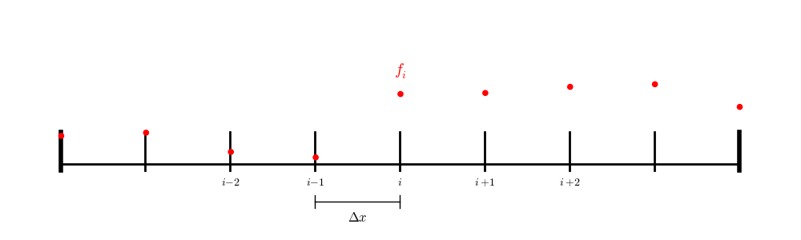

*******************************
Poisson Equation and Relaxation
*******************************

We want to solve the Poisson equation:

.. math::

   \nabla^2 \phi = f

We'll do it in 1-d, writing our equation as:

.. math::

   \frac{d^2 \phi}{dx^2} = f

on a domain :math:`[a, b]`.

We will represent :math:`\phi` and :math:`f` on a 1-d uniform grid:

   Our 1-d finite difference grid

Here we represent the discrete value of $\phi$ with a subscript:

.. math::

   \phi_i = \phi(x_i)

and similarly for $f_i$.

Notice that with this grid we have a point on each boundary.  We will set these points to the boundary conditions:

.. math::

   \phi(a) = A

.. math::

   \phi(b) = B

Here's a class that implements smoothing:

.. literalinclude:: ../../examples/numerical_algorithms/poisson/poisson.H
   :language: c++
   :caption: ``poisson.H``

Let's try it on the problem:

.. math::

   \phi^{\prime\prime} = \sin(x)

on :math:`[0, 1]` with the boundary conditions:

.. math::

   \phi(0) = 0

.. math::

   \phi(1) = 1

This has the analytic solution:

.. math::

   \phi(x) = -\sin(x)  + (1 + \sin(1)) x

Here's the driver that implements this problem:

.. literalinclude:: ../../examples/numerical_algorithms/poisson/poisson.cpp
   :language: c++
   :caption: ``poisson.cpp``

