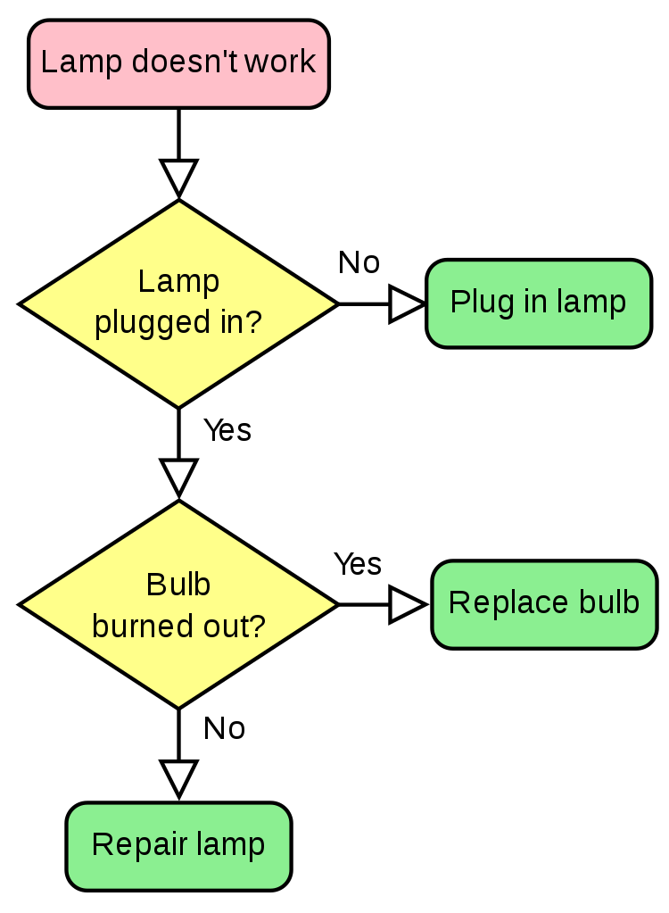
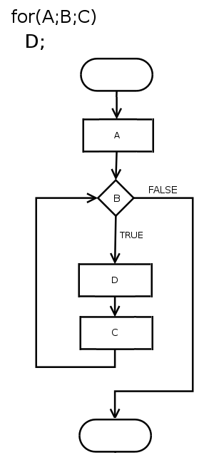

**************************
Structure of a C++ Program
**************************

.. admonition:: reading

   Cyganek section 2.4

Flowcharts
==========

We can represent algorithms using flowcharts.  There are some
`standard symbols
<https://en.wikipedia.org/wiki/Flowchart#Common_symbols>`_ used in
programming flowcharts that you should be familiar with.

Here's an example of a flowchart of the thought process in debugging a broken lamp:

   `(Booyabazooka/Wikipedia) <https://commons.wikimedia.org/wiki/File:LampFlowchart.svg>`_

Flowcharts can also have loops, like this example for a code that appears as:

.. code:: c++

   for (A; B; C)
       D;

   `(Paweł Zdziarski (faxe)/Wikipedia) <https://en.wikipedia.org/wiki/Flowchart#/media/File:For-loop-diagram.png>`_

An alternative to flowcharts is to write out the algorithm in
`pseudocode <https://en.wikipedia.org/wiki/Pseudocode>`_

Both of these concepts help you layout the organization of your
program before you start writing the code.

Hello, World
============

Let's look at a simple "Hello, World" program (your text has an
example to computes the square root of an input number).

.. important::

   Every C++ program needs to have a ``main()`` function

.. code:: c++

   #include <iostream>

   // our Hello, World program

   int main()
   {
      std::cout << "Hello World!" << std::endl;
   }

A nice breakdown of a "Hello, World" program is shown here: https://www.cplusplus.com/doc/tutorial/program_structure/ -- let's walk through that.

A few important bits:

* A preprocessor is used to bring additional functionality into our code
  (the ``#include``)

* C++ comments start with ``//``

* Each C++ program needs to have a function called ``main()`` and that function
  is of type ``int``.

* ``{`` and ``}`` are used to denote blocks of code in C++

* The C++ Standard Library provides a lot of useful functions and
  capabilities.  Here we use ``std::cout`` from the standard library
  to output.

* ``<<`` is an operator in C++.  Its meaning can depend on context.
  Here it is used to pass ``"Hello, World!"`` to ``cout``

* ``::`` is the scope operator.  This tells us that ``cout`` is part of a *namespace*
  called ``std``, and the compiler should look there for its implementation.

* Statements end with ``;``

